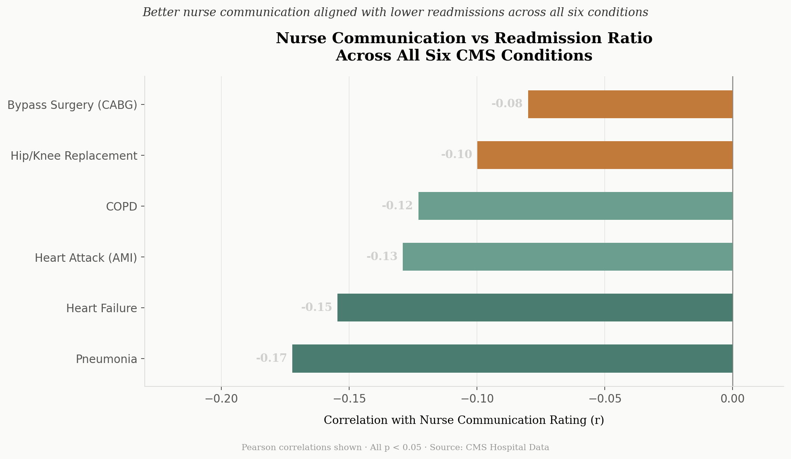
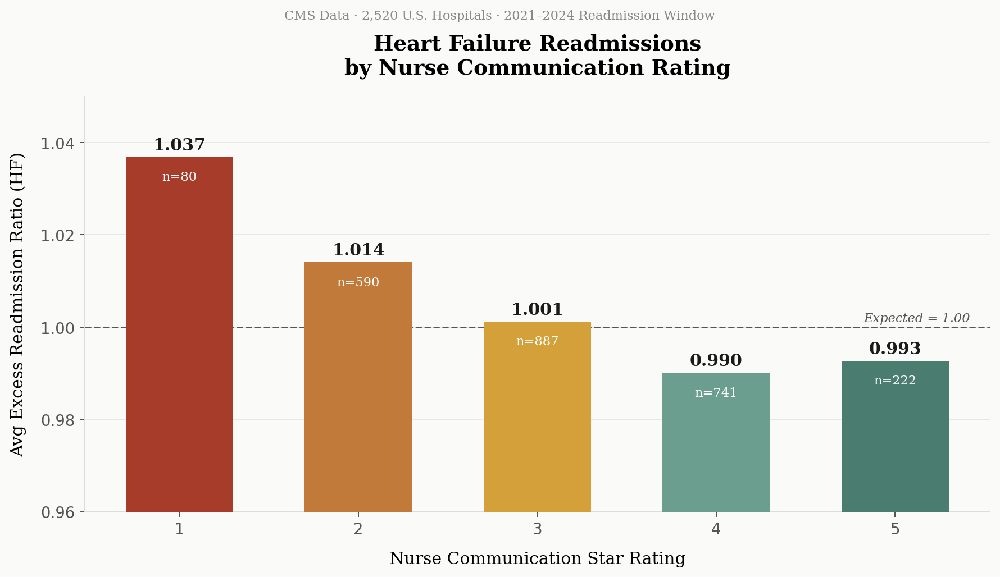

# Nurse Communication and Hospital Readmissions
## A Cross-Dataset Analysis of CMS Patient Experience and Readmission Outcomes

> A SQL and Python analysis joining CMS HCAHPS patient experience data with CMS Hospital Readmissions Reduction Program data across 2,500+ U.S. hospitals, finding that nurse communication quality is consistently associated with lower-than-expected readmission ratios across all six tracked conditions.

---

## Project Overview

The previous project in this portfolio identified nurse communication as the strongest operational predictor of overall hospital satisfaction (r = 0.79) across 22,000 facilities. A natural follow-up question emerged: does nurse communication also connect to measurable clinical outcomes, or is its effect limited to patient perception?

This project extends that analysis by joining HCAHPS patient experience data to CMS Hospital Readmissions Reduction Program (HRRP) data, testing whether hospitals with stronger nurse communication ratings tend to have lower-than-expected readmission ratios across the six conditions CMS tracks: heart failure, COPD, pneumonia, heart attack (AMI), hip/knee replacement, and bypass surgery (CABG).

The answer is yes, and the pattern is consistent across every condition tested.

---

## Business Context

Hospital readmissions are one of the most closely monitored operational metrics in healthcare. Since 2012, CMS has reduced Medicare payments for hospitals with excess readmissions under the HRRP. An excess readmission ratio above 1.0 means a hospital is readmitting more patients than expected given its patient mix.

Reducing readmissions requires patients to understand their diagnosis, follow discharge instructions, manage medications, and recognize when to seek follow-up care. All of this depends heavily on how clearly and effectively nurses communicate during the hospital stay.

If nurse communication quality predicts both patient satisfaction and readmission performance, it becomes a leading operational indicator worth monitoring across hospital systems. Hospitals waiting for readmission penalties to reveal problems may be reacting too late. Communication scores that are already being collected and reported could serve as an earlier signal.

---

## Datasets

**Dataset 1: CMS HCAHPS Patient Survey (2024 Reporting Year)**
- Source: data.cms.gov
- Used for: nurse communication star ratings (1 to 5) per facility
- Reused from the previous project in this portfolio

**Dataset 2: CMS Hospital Readmissions Reduction Program**
- Source: data.cms.gov
- Reporting window: July 2021 to June 2024 (3-year rolling window)
- Used for: excess readmission ratio per facility per condition
- An excess readmission ratio above 1.0 indicates worse-than-expected performance; below 1.0 indicates better-than-expected

Both datasets share a common CMS facility identifier, enabling a direct join at the hospital level.

---

## Methodology

### 1. Data Filtering and Cleaning (SQL + DuckDB)
- Filtered HRRP data to each of the six tracked conditions separately
- Removed rows where excess readmission ratio was reported as N/A or "Too Few to Report"
- Joined to the existing HCAHPS KPI table on facility ID using an inner join
- Ensured nurse communication stars were numeric and non-null

### 2. Condition-by-Condition Analysis
- Ran Pearson and Spearman correlations between nurse communication stars and excess readmission ratio for each condition independently
- Computed grouped means by nurse star rating (1 to 5) for each condition
- Avoided averaging across conditions to preserve interpretability

### 3. Summary Table
- Compiled correlation results across all six conditions into a single summary table to identify patterns by condition type

---

## Results

### 1. Correlation Summary Across All Six Conditions

| Condition | n | Pearson r | Spearman rho |
|-----------|---|-----------|--------------|
| Pneumonia | 2,539 | **-0.172** | -0.164 |
| Heart Failure | 2,520 | -0.155 | -0.153 |
| Heart Attack (AMI) | 1,727 | -0.129 | -0.128 |
| COPD | 2,265 | -0.123 | -0.122 |
| Hip/Knee Replacement | 1,418 | -0.100 | -0.073 |
| Bypass Surgery (CABG) | 878 | -0.080 | -0.069 |

All correlations are negative (better communication, lower readmission ratio) and all are statistically significant (p < 0.05). The relationship holds across every condition CMS tracks.



---

### 2. Grouped Means: Heart Failure

Heart failure is among the strongest signals and represents the most common chronic condition in the dataset. Hospitals with 1-star nurse communication averaged an excess readmission ratio of 1.037 (worse than expected). Hospitals with 4 and 5-star ratings averaged 0.990 and 0.993 respectively (better than expected).

| Nurse Comm Stars | Avg HF Ratio | n |
|-----------------|-------------|---|
| 1 | 1.037 | 80 |
| 2 | 1.014 | 590 |
| 3 | 1.001 | 887 |
| 4 | **0.990** | 741 |
| 5 | 0.993 | 222 |

The 1.0 threshold is operationally meaningful: above it, a hospital is readmitting more patients than CMS expects given its patient mix. The trend from 1-star to 4-star crosses that threshold consistently.



---

### 3. Pattern by Condition Type

The correlation was strongest for chronic medical conditions: pneumonia (r = -0.172), heart failure (r = -0.155), AMI (r = -0.129), and COPD (r = -0.123). It was weaker for surgical conditions: hip/knee replacement (r = -0.100) and bypass surgery (r = -0.080).

One plausible explanation is that chronic-condition recoveries depend more heavily on patient self-management after discharge. Patients with heart failure, COPD, pneumonia, or AMI often need to understand medications, recognize symptom escalation, follow dietary guidance, schedule follow-up care, and know when to seek urgent treatment. If nurses communicate clearly during admission, patients may leave better equipped to manage that complexity. If they do not, poorer outcomes may be more likely to surface downstream as readmissions.

For surgical conditions like hip/knee replacement or CABG, readmissions may be more influenced by operative complexity, wound healing, post-surgical complications, and standardized recovery pathways. The relative role of communication may therefore be smaller because recovery is more protocol-driven and less dependent on patient comprehension alone.

The fact that the relationship varies in a clinically intuitive direction strengthens confidence that the signal is meaningful rather than random noise. This is not a uniform statistical artifact. It is a pattern that makes biological and operational sense.

**Communication may matter most when recovery shifts responsibility from hospital staff to the patient.**

---

## Operational Implications

Nurse communication is not a soft metric. Across 2,500+ hospitals and six clinical conditions, hospitals with stronger nurse communication ratings consistently showed lower-than-expected readmission ratios. The relationship is modest in magnitude but statistically robust and directionally consistent.

The sub-dimension findings from the previous project add specificity here. If the nurse communication gap is driven primarily by explanation clarity (74.1% always) and active listening (75.9% always) rather than courtesy (85.7% always), then readmission reduction efforts may benefit most from targeted interventions in those areas: plain-language discharge instruction, teach-back methodology, and structured listening protocols like AIDET.

For hospital systems tracking both HCAHPS scores and readmission performance, nurse communication quality may serve as a practical leading indicator. States and facilities that underperform on communication metrics tend to underperform on readmissions as well, particularly for chronic and medical conditions.

Nurse communication may also proxy for broader operational quality: clarity of discharge education, patient trust, medication explanation quality, responsiveness during admission, and care transition readiness. High-leverage interventions could include teach-back methodology, standardized discharge communication workflows, medication explanation scripting, active listening training, and post-discharge follow-up coordination.

Patient experience data is often treated as soft data. This analysis suggests otherwise. Sometimes the clearest signal of operational quality comes directly from the patient.

---

## Limitations

- Correlations are associational, not causal. Well-resourced hospitals may perform better on both dimensions simultaneously due to factors not captured here, such as staffing ratios, facility type, or patient population characteristics.
- The HRRP data uses a 3-year rolling window (2021 to 2024) while the HCAHPS data reflects 2024. The time periods are overlapping but not identical.
- Excess readmission ratio is already adjusted for patient mix, which strengthens comparability, but residual confounding from hospital size, teaching status, and regional factors remains.
- Conditions with smaller sample sizes (CABG: n=878, hip/knee: n=1,418) should be interpreted with more caution than high-volume conditions like pneumonia and heart failure.
- Nurse communication scores may also proxy for broader organizational quality, meaning the relationship with readmissions could partially reflect overall hospital resource levels rather than communication specifically.

---

## Project Structure

```
hospital-readmissions-analysis/
├── README.md
├── data/
│   ├── raw/
│   │   ├── HCAHPS-Hospital.csv
│   │   └── FY_2026_Hospital_Readmissions_Reduction_Program_Hospital.csv
│   └── processed/
│       ├── hospital_kpis_2024.csv
│       ├── hf_nurse_comm_joined.csv
│       ├── hf_grouped_summary.csv
│       ├── all_conditions_summary.csv
│       └── all_conditions_grouped.csv
├── db/
│   └── readmissions.duckdb
├── sql/
│   ├── 01_build_hf_joined.sql
│   └── 02_build_all_conditions_joined.sql
├── src/
│   ├── analyze.py
│   ├── analyze_all_conditions.py
│   └── make_figures.py
├── dashboard/
│   └── figures/
│       ├── 01_hf_nurse_comm.png
│       └── 02_correlation_by_condition.png
├── reports/
│   └── insights_report.md
└── requirements.txt
```

---

## Tools and Skills Demonstrated

- SQL querying, filtering, and cross-dataset joining (DuckDB)
- Long-format data cleaning and null handling at scale
- Pearson and Spearman correlation analysis
- Grouped aggregation and trend analysis by ordinal variable
- Multi-condition comparative analysis
- Healthcare data interpretation (HCAHPS, HRRP, CMS)
- Analytical storytelling and operational framing
- Reproducible pipeline design

---

## Portfolio Context

This project is the third in a healthcare operations analytics portfolio:

| Project | Focus |
|---------|-------|
| Preventable Punchlisting Analysis | Root-cause analysis of operational failure in healthcare IT deployment workflows |
| Hospital Patient Experience Analytics | Performance monitoring and insight generation from national HCAHPS data |
| Nurse Communication and Readmissions *(this project)* | Cross-dataset analysis connecting patient experience metrics to clinical outcome data |

Together they demonstrate a complete analytical arc:

**Diagnose operational breakdown → Monitor performance at scale → Connect experience metrics to clinical outcomes.**

---

## Author

Asim Bacchus
[LinkedIn](https://www.linkedin.com/in/asimbacchus/) | [GitHub](https://github.com/Asim-Bacchus)